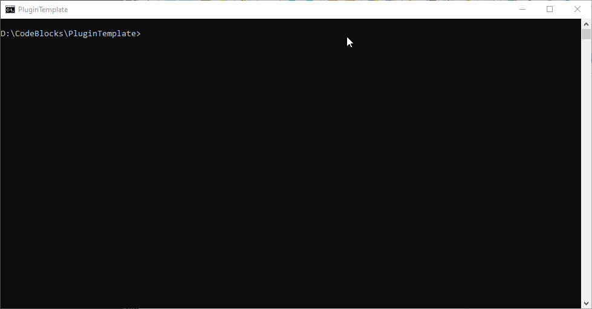

# PluginTemplate

Template CMake project for x64dbg plugins.

## Using the template

You can click the green *Use this template* button. See the article [*Creating a repository from a template*
](https://docs.github.com/en/free-pro-team@latest/github/creating-cloning-and-archiving-repositories/creating-a-repository-from-a-template) by GitHub for more details.

Alternatively you can download a ZIP of this repository and set up the template locally.

## Building

From a Visual Studio command prompt:

```
mkdir build && cd build
cmake ..
```

You will get `PluginTemplate.sln` that you can open in Visual Studio.

Alternatively you can open this folder in Visual Studio/CLion/Qt Creator.



